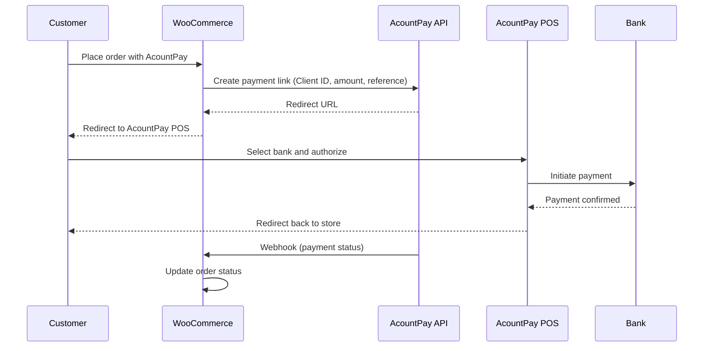

Accept bank payments on your WooCommerce store with the official AcountPay plugin. Supports both classic and block-based checkout.

## Prerequisites

- **WordPress** 5.8 or higher
- **WooCommerce** 8.0 or higher
- **PHP** 7.4 or higher
- An **AcountPay merchant account** with a Client ID

## Step 1: Get your Client ID

<Steps>
  <Step title="Log in to the Merchant Dashboard">
    Go to [merchant.acountpay.com](https://merchant.acountpay.com) and sign in with your merchant account.
  </Step>
  <Step title="Navigate to Developer settings">
    In the dashboard sidebar, click **Developer**.
  </Step>
  <Step title="Copy your Client ID">
    Copy the **Client ID** shown on this page. You will paste it into the plugin settings in a later step.
  </Step>
</Steps>

<Info>
  The same Client ID works for both test and live modes. You switch between modes in the plugin settings.
</Info>

## Step 2: Install the plugin

<Steps>
  <Step title="Download the plugin">
    Download the plugin ZIP from the [AcountPay WooCommerce GitHub repository](https://github.com/PaywithAcount/AP-Woo-Plugin). Click **Code > Download ZIP**, or download directly: [Download ZIP](https://github.com/PaywithAcount/AP-Woo-Plugin/archive/refs/heads/main.zip).
  </Step>
  <Step title="Upload to WordPress">
    In your WordPress admin panel, go to **Plugins > Add New > Upload Plugin**. Choose the downloaded ZIP file and click **Install Now**.
  </Step>
  <Step title="Activate">
    After installation completes, click **Activate Plugin**.
  </Step>
</Steps>

<Tip>
  If uploading manually via FTP, place the plugin folder in `wp-content/plugins/` so the main file is at `wp-content/plugins/acountpay-payment/acountpay-payment.php`, then activate it from **Plugins** in WordPress admin.
</Tip>

## Step 3: Configure the gateway

<Steps>
  <Step title="Open payment settings">
    Go to **WooCommerce > Settings > Payments**.
  </Step>
  <Step title="Enable AcountPay">
    Find **AcountPay Payment Gateway** in the list and click **Set up** (or **Manage**).
  </Step>
  <Step title="Enter your settings">
    Configure the following fields:

    | Setting | Value |
    |---------|-------|
    | **Enable/Disable** | Check to enable |
    | **Payment Mode** | **Test** for testing, **Live** for real payments |
    | **Client ID** | Paste the Client ID from the Merchant Dashboard |
    | **API Base URL** | Leave as default (`https://api.acountpay.com`) |
    | **Title** | Display name at checkout (e.g. "Pay with AcountPay") |
    | **Description** | Short text shown under the payment method |
    | **Enable Logging** | Enable during testing for debugging |
    | **SSL Verification** | Keep enabled for production |
  </Step>
  <Step title="Save">
    Click **Save changes**.
  </Step>
</Steps>

AcountPay will now appear as a payment option on your checkout page (both classic and block-based).

## Step 4: Test a payment

<Steps>
  <Step title="Set mode to Test">
    In the gateway settings, set **Payment Mode** to **Test**.
  </Step>
  <Step title="Place a test order">
    Add a product to the cart, go to **Checkout**, and select **AcountPay** as the payment method.
  </Step>
  <Step title="Complete the payment">
    You will be redirected to AcountPay to select your bank and authorize the payment. After completing the payment, you are returned to your store's order confirmation page.
  </Step>
  <Step title="Verify the order">
    Check **WooCommerce > Orders** to confirm the order status updated to **Processing**.
  </Step>
</Steps>

## Step 5: Go live

Once testing is successful:

1. Go to **WooCommerce > Settings > Payments > AcountPay Payment Gateway**.
2. Change **Payment Mode** to **Live**.
3. Click **Save changes**.

Your store is now accepting real payments via AcountPay.

## How it works

## Troubleshooting

<AccordionGroup>
  <Accordion title="Payment method not appearing at checkout">
    - Verify the plugin is activated in **Plugins**.
    - Check that **Enable/Disable** is checked in the gateway settings.
    - Ensure WooCommerce is active and your store has at least one product.
  </Accordion>

  <Accordion title="Payment fails or shows an error">
    - Enable **Enable Logging** in the gateway settings.
    - Check logs at **WooCommerce > Status > Logs** and filter for `acountpay-payment`.
    - Verify your **Client ID** is correct.
    - Ensure the **API Base URL** is `https://api.acountpay.com`.
  </Accordion>

  <Accordion title="Order stuck on 'On Hold'">
    The webhook from AcountPay may not have arrived yet. This can happen if:
    - Your site is not publicly accessible (e.g. running on localhost). Webhooks require a public URL.
    - A firewall is blocking incoming requests from AcountPay.

    Check the order notes for details on what status was received.
  </Accordion>

  <Accordion title="SSL certificate errors">
    If you see SSL errors in the logs, you can temporarily disable **SSL Verification** in the gateway settings for testing. Keep it enabled in production.
  </Accordion>
</AccordionGroup>

## Settings reference

| Setting | Description | Default |
|---------|-------------|---------|
| **Enable/Disable** | Enable the AcountPay gateway | Disabled |
| **Payment Mode** | Test or Live | Test |
| **Title** | Label shown at checkout | AcountPay Payment Gateway |
| **Description** | Text shown under the payment method | Pay securely using your bank account via AcountPay Payment Gateway. |
| **Client ID** | Your Client ID from [merchant.acountpay.com](https://merchant.acountpay.com) | -- |
| **API Base URL** | AcountPay API endpoint | `https://api.acountpay.com` |
| **Enable Logging** | Log API requests/responses for debugging | Disabled |
| **SSL Verification** | Verify SSL certificates on API calls | Enabled |
| **Redirect URL** | Custom post-payment redirect (optional) | Order received page |

## Support

For setup or technical issues, visit [acountpay.com](https://acountpay.com) or contact your AcountPay representative.
